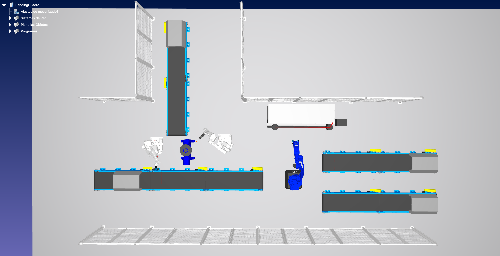

# PR2-A6 - Automatización del proceso de cuadros eléctricos

## Resumen
Este proyecto desarrolla una celda automatizada para la fabricación de cuadros eléctricos en entorno RoboDK.
La implementación actual esta centrada en simulación y en la traducción funcional de la lógica de proceso a Python.

<p align="center">
	
</p>

## Objetivo de la propuesta
- Alimentación de material a través de cintas.
- Pick-and-place robotizado.
- Plegado de planchas.
- Soldadura robotizada.
- Montaje del cuadro.
- Etiquetado del cuadro.

Adicionalmente, la propuesta contempla:
- Integración con nodos ESP32.
- Mensajeria MQTT para coordinación.
- Intercambio de estados y ordenes en JSON.

## Estado actual del proyecto
### Hecho
- Traduccion principal de la logica de RoboDK a scripts Python.
- Flujo funcional de simulación implementado por fases.
- Correcciones base de estabilidad y reutilizacion aplicadas.
- Integracion de E/S para sincronizacion (`waitDI` / `setDO`).
- Integracion de comunicaciones con ESP32 y MQTT.
- Integracion con base de datos para trazabilidad.

### En progreso / pendiente
- Definicion de pruebas de regresion y validacion automatica.

## Requisitos
- RoboDK instalado y estacion de simulación disponible.
- Python 3.9+ (compatible con el interprete integrado de RoboDK.)
- Paquete Python `robodk` instalado en el entorno activo.
- Si se ejecuta con PySide2/shiboken2, usar `numpy<2` para evitar incompatibilidades binarias.
- Paquetes paho-mqtt y psycopg para poder conectarse a MQTT y a la Base de Datos SQL

## Preparacion del entorno
Desde la raiz del proyecto:

```bash
python3 -m venv .venv
source .venv/bin/activate
python -m pip install -U pip
python -m pip install robodk "numpy<2"
```

Comprobacion:

```bash
python -c "import robodk, sys; print(sys.executable; print(robodk.__file__"
```

## Ejecución
- Ejecutar script main desde RoboDK con la estación abierta.
